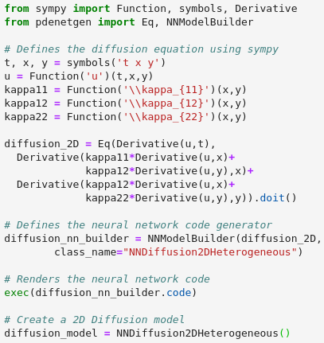
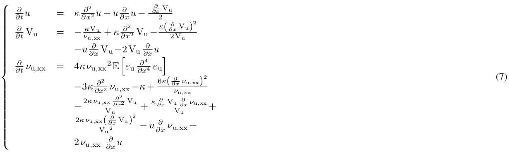
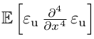
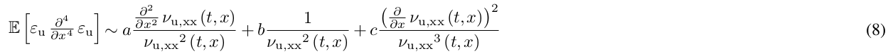
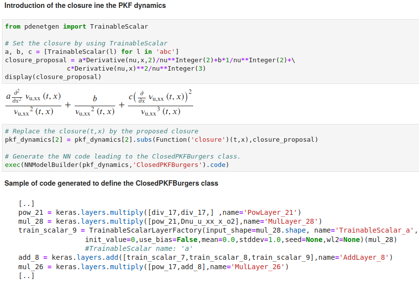

[PDE-NetGen : from symbolic PDE representations of physical processes to trainable neural network representations.](https://github.com/opannekoucke/pdenetgen)<!-- omit in toc -->
====================================================================


---

<h2><center>Contents</center></h2>

- [Introduction](#introduction)
- [Example](#example)
  - [Implementation of a simple PDE: the 2D diffusion equation](#implementation-of-a-simple-pde-the-2d-diffusion-equation)
  - [Estimation of an unknown physical term](#estimation-of-an-unknown-physical-term)
    - [1. Implementation using `TrainableScalar`](#1-implementation-using-trainablescalar)
    - [2. Implementation using an external neural network (the exogenous case)](#2-implementation-using-an-external-neural-network-the-exogenous-case)
- [Install](#install)
- [Citation](#citation)

---


Introduction
------------

Bridging physics and deep learning is a topical challenge. While deep learning frameworks open avenues in physical science, the design of physically-consistent deep neural network architectures is an open issue. In the spirit of physics-informed NNs, PDE-NetGen package provides new means to automatically translate physical equations, given as PDEs, into neural network architectures. PDE-NetGen combines symbolic calculus and a neural network generator. The later exploits NN-based implementations of PDE solvers using Keras. With some knowledge of a problem, PDE-NetGen is a plug-and-play tool to generate physics-informed NN architectures. They provide computationally-efficient yet compact representations to address a variety of issues, including among others adjoint derivation, model calibration, forecasting, data assimilation as well as uncertainty quantification. As an illustration, the workflow is first presented for the 2D diffusion equation, then applied to the data-driven and physics-informed identification of uncertainty dynamics for the Burgers equation.


  - O. Pannekoucke and R. Fablet, “PDE-NetGen 1.0: from symbolic partial differential equation (PDE) representations of physical processes to trainable neural network representations,” Geoscientific Model Development, vol. 13, no. 7, pp. 3373–3382, Jul. 2020, doi: 10.5194/gmd-13-3373-2020.


<div>
<div style="float:left">
This work has been supported by the French INSU-LEFE, grant KAPA 
</div>
<div>
  
</div>
</div>

Example
-------

### Implementation of a simple PDE: the 2D diffusion equation

A diffusion over a 2D domain can be implemented as



(see the notebook [./example/pdenetgen-diffusion2D.ipynb](./example/pdenetgen-diffusion2D.ipynb))

### Estimation of an unknown physical term

As an example, we consider a situation that can be encountered in physics where the 
dynamics makes appear an unkown term to determine from a dataset. For the illustration, we consider the dynamics 



where the term  is unkown.


With PDE-NetGen, we can design a closure from the data. For the 
illustration we consider a candidate for the closure, given by



where $(a,b,c)$ are unkowns.

Two implementations can be considered. 

#### 1. Implementation using `TrainableScalar`

This is implemented by using `TrainableScalar` as follows:
 
 1. the candidate for the closure is defined as a symbolic level
 2. a neural network that implement the full dynamics (including the closure) is then generated and ready for the training



The use of `TrainableScalar` is the simplest way to try a closure designed from partial derivatives.

(see the notebook 
[./example/pdenetgen-NN-PKF_burgers_learn-TrainableScalar-closure.ipynb](./example/pdenetgen-NN-PKF_burgers_learn-TrainableScalar-closure.ipynb))

#### 2. Implementation using an external neural network (the exogenous case)

Another implemention is possible that relies on the introduction
of an external neural network, for instance a deep neural network of your choice that you have to build by yourself and
that can be plugged to the neural network generated from Eq.(7)
. 

(see the notebook 
[./example/pdenetgen-NN-PKF_burgers_learn-exogenous-closure.ipynb](./example/pdenetgen-NN-PKF_burgers_learn-exogenous-closure.ipynb)
where the closure is provided as the implementation of Eq.(8) -- you can try your own NN that can be different from the candidate Eq.(8))

Install
-------

### Using pip

PDE-NetGen is available from pip, and can be installed as 
`pip install pdenetgen`

### From github
 1. Clone the repository `git clone https://github.com/opannekoucke/pdenetgen.git`
 1. Install the package `make install` (or `python setup.py install`)
 1. Examples are given as jupyter notebooks (see ./example/) 

### Remove pdenetgen

`pip uninstall pdenetgen`

Citation
--------

Pannekoucke, O. and Fablet, R.: PDE-NetGen 1.0: from symbolic partial differential equation (PDE) representations of physical processes to trainable neural network representations, Geosci. Model Dev., 13, 3373–3382, https://doi.org/10.5194/gmd-13-3373-2020, 2020. 

```
@Article{Pannekoucke2020GMD,
  author    = {Olivier Pannekoucke and Ronan Fablet},
  journal   = {Geoscientific Model Development},
  title     = {{PDE}-{NetGen} 1.0: from symbolic partial differential equation ({PDE}) representations of physical processes to trainable neural network representations},
  year      = {2020},
  month     = {jul},
  number    = {7},
  pages     = {3373--3382},
  volume    = {13},
  doi       = {10.5194/gmd-13-3373-2020},
  publisher = {Copernicus {GmbH}},  
}
```
